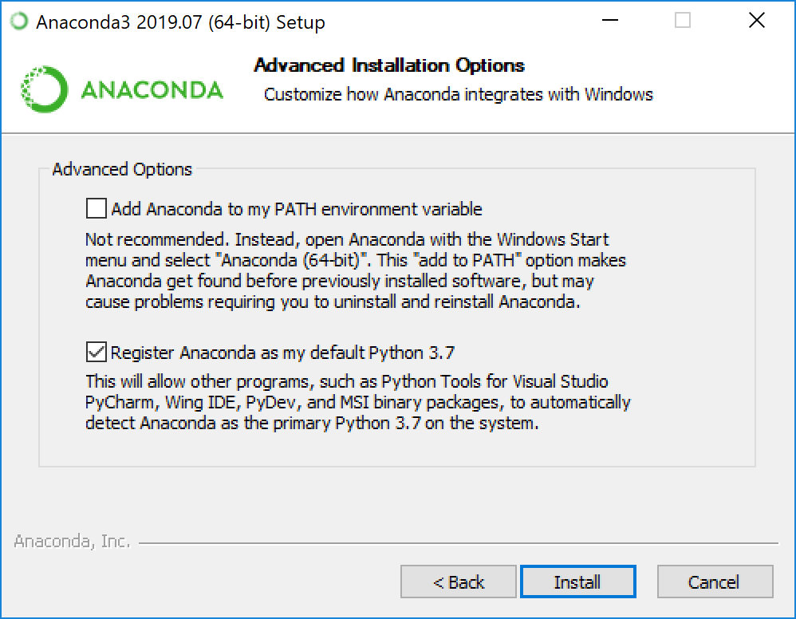
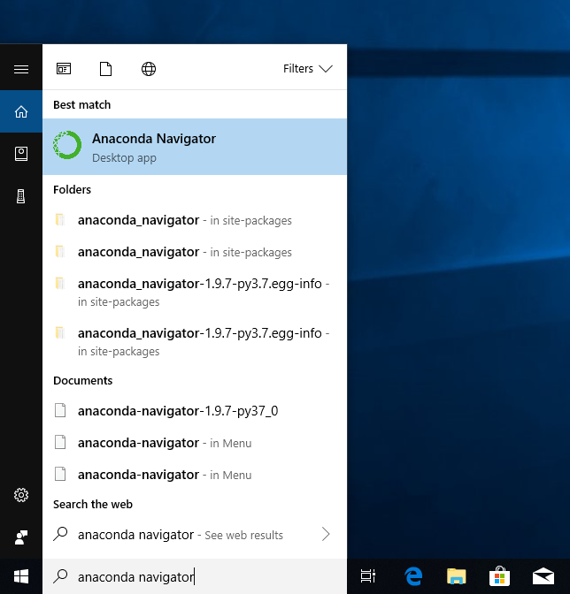
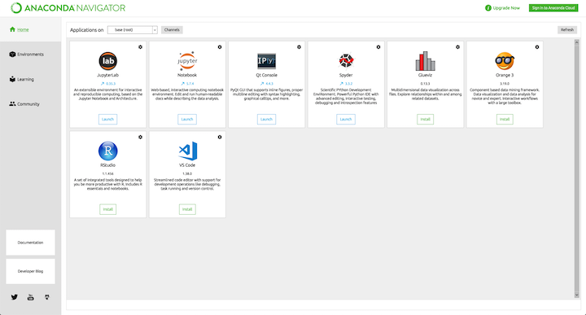
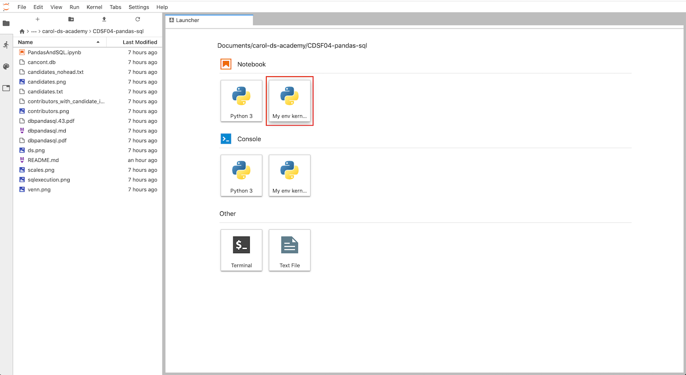
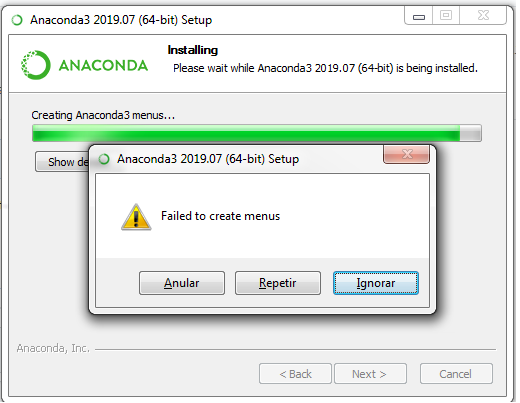

# Installing Python

We are going to use the the Anaconda python distribution. Anaconda has a built in package manager and environment manager (conda) 
that you use with command line commands at the Anaconda Prompt for Windows, or in a terminal window for macOS or Linux.
It helps to avoid problems during the installation process of some packages. 

## Installing on Windows

Download the last version from [Anaconda website]( https://www.anaconda.com/distribution/#windows). Always use python 3+.
[python 2.7](https://pythonclock.org/) will not be maintained past 2020. Also, rememeber to check if your machine is x32 or x64 and download the compatible one. 

To install it is easy, double click the installer to launch. Follow the instructions. During the installation it will be
shown a message to add Anaconda to the PATH. I recommend to select this option if this is the first python distribution
you are installing. Unless you plan on installing and running multiple versions of
Python, accept the default and leave this box checked.



This will install the following application



## Installing on macOS
 
Download the last version from [Anaconda website]( https://www.anaconda.com/downloads#macos). Always use python 3+.
[python 2.7](https://pythonclock.org/) will not be maintained past 2020. 

To install it is easy, double click the installer to launch. Follow the instructions. 
After your install is complete, verify it by opening Anaconda Navigator. From Launchpad, 
select Anaconda Navigator. If Navigator opens, you have successfully installed Anaconda. 


It is possible to install using command line. Please follow the instruction from the 
[website](https://docs.anaconda.com/anaconda/install/mac-os/)

## Installing on linux
Follow the instruction from the  [website](https://docs.anaconda.com/anaconda/install/linux/)

## Verifying your installation
You can confirm that Anaconda is installed and working with Anaconda Navigator or conda.

You can also use conda in a terminal, command prompt on Windows or terminal on Linux or macOS).
On Windows, there is an option of using Anaconda Prompt (Click Start, select Anaconda Prompt)

After opening Anaconda prompt (terminal on Linux or macOS), choose any of the following methods:

Enter a command such as `conda list`. If Anaconda is installed and working, this will display a 
list of installed packages and their versions.
Enter the command `python`. This command runs the Python shell.
 If Anaconda is installed and working, the version information it displays when it 
 starts up will include “Anaconda”. To exit the Python shell, enter the command `quit()`.
Open Anaconda Navigator with the command anaconda-navigator. 
If Anaconda is installed properly, the graphical program Anaconda Navigator will open.


# Run Python in a Jupyter Notebook

We are going to use jupyter notebooks during the lessons. To start a notebook, Open Anaconda 
Navigator e select Jupyter Lab



This will open Jupyter lab. It is a python environment we can play. 


# Managing  and creating environments 

With conda, you can create, export, list, remove, and update
environments that have different versions of Python and 
packages installed. Switching or moving between
environments is called activating the environment. You can also
share an environment file.

To activate a environment use:

* Windows: ``activate env_name`` or ``deactivate env_name``
* Linux and macOS: ``conda activate env_name`` or ``conda deactivate env_name``

### Creating an environment with commands

```bash
conda create --name myenv
```
conda will ask you to proceed, type ``y``:

To create an environment with a specific version of Python:
```bash
conda create -n myenv python=3.6
```
To create an environment with a specific package:

```bash
conda create -n myenv scipy
```
or, if the env already exits 
```bash
conda install -n myenv scipy
```

You can add much more to the ``conda create`` command. 
For details, run ``conda create --help``.

### Verify that the new environment was installed correctly:
```bash
conda env list
```
You can also use ``conda info --envs``.
 
 
### Activating an environment

Activating environments is essential to making the software in the environments
work well. To activate an environment: `activate myenv` for windows and
`conda activate myenv` for linux and macOS.

### Deactivating an environment

To deactivate an environment, type: `deactivate` on windows 
(`conda deactivate` on linux and macOS)

### Using pip in an environment


To use pip in your environment, in your terminal window or an
Anaconda Prompt, run:

```bash
conda install -n myenv pip
conda activate myenv
pip <pip_subcommand>
```


## Installing a new environment (kernel) on the jupyter notebook.

It is possible to create a kernel on jupyter with a conda environment. To do so, 

```bash
conda create -n myenv
conda activate myenv
conda install -n myenv ipykernel
python -m ipykernel install --user --name myenv --display-name "My env kernel"
```

This will create a new option of kernel in the jupyter lab




## Removing a kernel on the jupyter notebook.

```bash
conda deactivate
jupyter kernelspec uninstall myenv
```


# Troubleshooting
1. Anaconda People are having problems with windowns installer. 


If this happens, try to install the version x32 instead of the x64. 


2. Anacaonda navegator does not appear to be installed. 
 If this happens, try to install the version x32 instead of the x64. 
